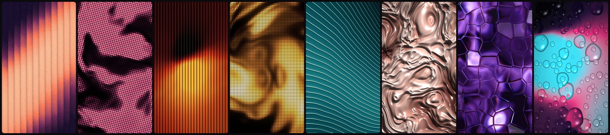
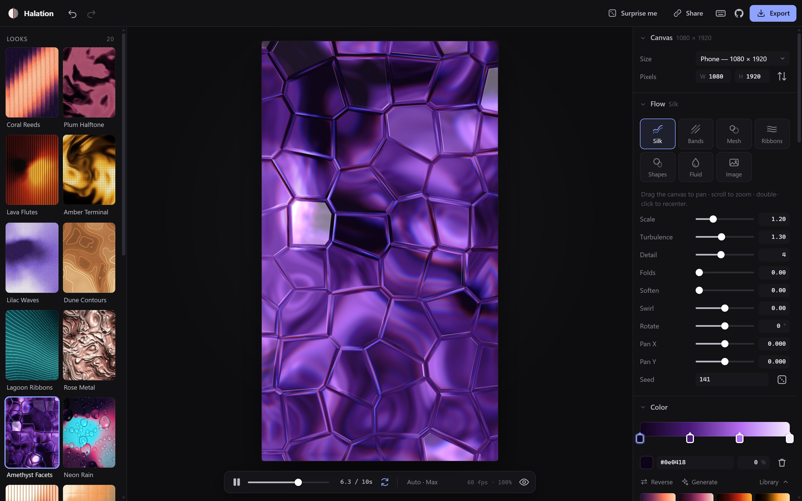
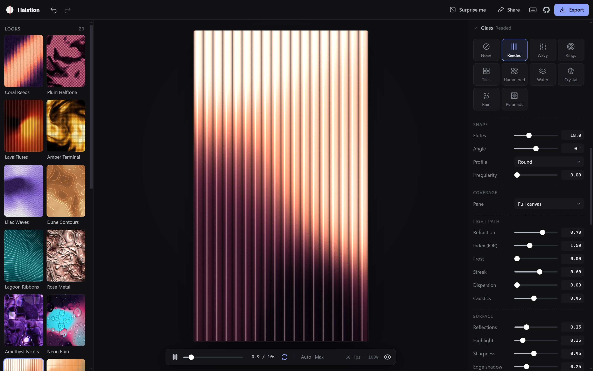
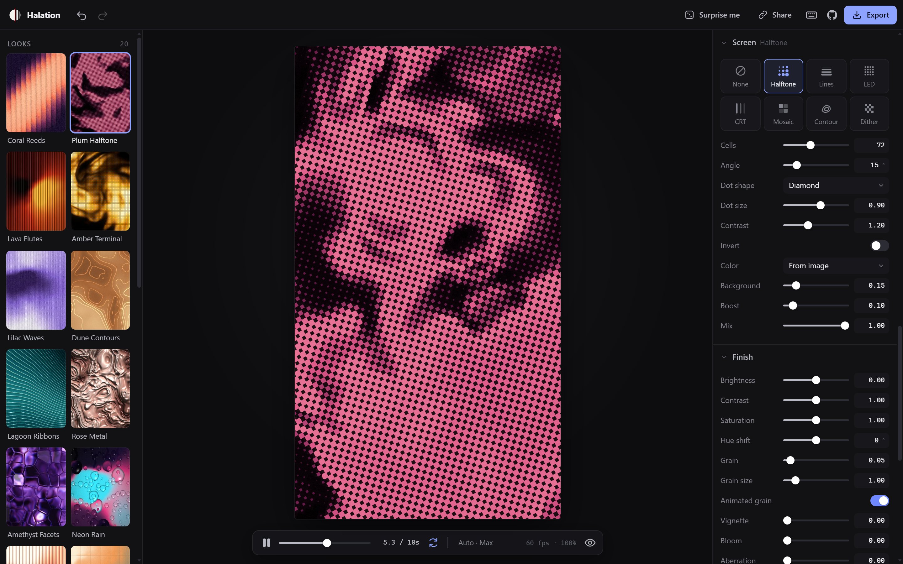
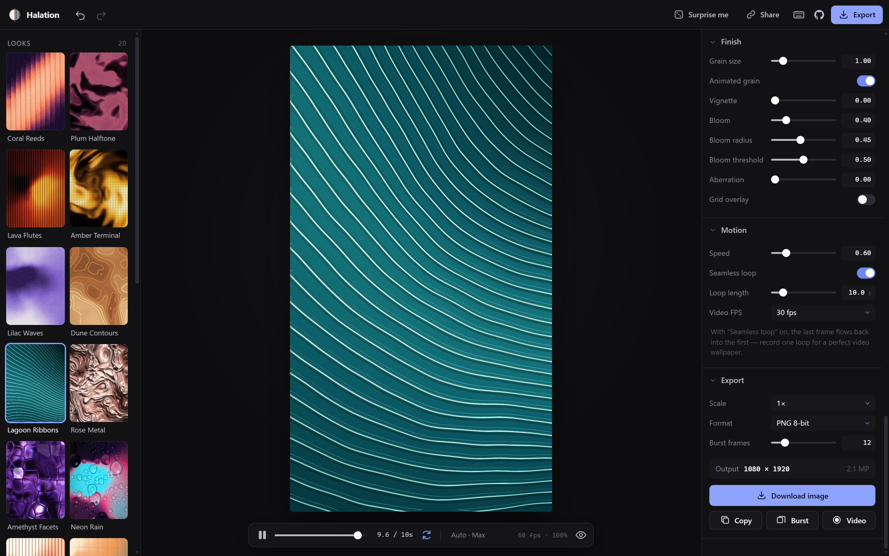

<p align="center">
  <picture>
    <source media="(prefers-color-scheme: dark)" srcset="assets/logo-mark-light.svg">
    
  </picture>
</p>

<h1 align="center">Halation</h1>

<p align="center"><b>Fluid gradients behind textured glass — a free, open-source background generator for designers.</b></p>

<p align="center"><a href="https://ar13x3.github.io/halation/"><b>Open Halation in your browser →</b></a></p>



Halation simulates flowing color fields and puts them behind reeded glass, halftone screens, LED matrices, topographic lines and more. Tweak everything live, then export high-resolution stills (up to 16-bit PNG), bursts of frames, or seamless-loop videos. It runs entirely in your browser on the GPU. There's nothing to install and nothing is uploaded.

## Screenshots



| Glass | Screen | Export |
| --- | --- | --- |
|  |  |  |

## Features

**Flow (the "fluid")**
- **Silk**: domain-warped noise, with optional sharp folds
- **Bands**: soft beams of light
- **Mesh**: drifting mesh-gradient color points
- **Ribbons**: glowing line bundles that wave and fan out
- **Shapes**: crisp, softly lit spheres, chain links and pills on a gradient backdrop, so the glass has something solid to break up
- **Fluid**: a real-time Navier–Stokes ink simulation; drag on the canvas to paint
- **Image**: drop in any picture and run it through the glass (with optional gradient-map recolor)
- Scale, turbulence, detail, swirl, rotation, soften, seed. Drag the canvas to pan and scroll to zoom.

**Color**
- Gradient editor with unlimited stops (smooth OKLab blending), a palette library and a palette generator
- Contrast, balance, repeat/mirror, offset, posterize, animated color cycling
- **Relief + gloss** light the flow like a 3D surface (liquid metal, satin…)

**Glass**: physically based light transport
- Types: Reeded (fluted), Wavy reeded, Concentric rings, Glass-block tiles, Hammered, Water surface, Crystal (bevelled facets), Rain on a fogged window (drops with trails), Pyramids (diamond prism sheet)
- Flute profiles: round, linear, prism, wave, bevel, glass block
- **Light path**: Snell refraction, index of refraction (IOR), frost with long-tailed scattering, streaks (defocused light smearing along the flutes), spectral dispersion, caustics
- **Surface**: Fresnel reflections of a light environment, total internal reflection at steep seams, highlights, edge shadow, Beer–Lambert tint
- **Coverage**: the pane can cover the full canvas, one side, a centered window or a vertical band, with a lit edge
- **Second pane**: stack another sheet behind the first (e.g. crossed reeds = quilted glass)

**Light**: direction, elevation, intensity and color, plus what the glass reflects (studio softbox, the palette's own colors, a window, or a dark room)

**Screen**: the "display" the image is seen through
- Halftone (circle / square / diamond), Line screens (straight / concentric rings / waves)
- LED matrix (round / square / RGB subpixels), CRT shadow mask, Mosaic (square / hex)
- Topographic contours with index lines, ordered dither

**Finish**: brightness, contrast, saturation, hue, film grain, vignette, bloom, chromatic aberration, and a technical grid overlay

**Motion & export**
- **Seamless loops**: time moves around a circle through 4D noise, so the last frame flows into the first
- **Download** PNG, **16-bit PNG** (no gradient banding), JPEG or WebP at 0.5×–4× of any canvas size
- **Copy** straight to the clipboard to paste into Figma, Photoshop, etc.
- **Burst**: capture N frames spread across the loop as a .zip, then pick your favorite
- **Video**: record exactly one loop as MP4/WebM, ready for animated wallpapers
- Canvas presets for phones, desktops, 4K, ultrawide, banners and print (A4 @ 300 dpi), or custom sizes

**Runs on modest hardware**
- Performance modes in the transport bar: **Auto** (benchmarks your GPU on load), **Eco** (low-power laptops: 30 fps cap, lower internal resolution), **Balanced** and **Max**
- Dynamic resolution keeps the moving preview smooth
- The modes only affect the *moving* preview. Once the image stops changing it refines itself to full quality: full resolution, with 16 jittered passes averaged to remove noise and antialias glass seams. Exports always render at full quality (96 samples per pixel), so stills and exports look identical on any machine.

**Workflow**
- 20 built-in looks, **Surprise me** (with per-section dice), undo/redo
- Save your own looks (with thumbnails), import/export them as JSON
- **Share links** that encode the whole look in the URL
- Your last session is restored automatically

### Keyboard shortcuts

| Key | Action |
| --- | --- |
| `Space` | Play / pause |
| `S` | Download image |
| `C` | Copy image to clipboard |
| `R` | Surprise me |
| `←` `→` | Step a frame (`Shift` = 1 s) |
| `1`–`9` | Jump to a built-in look |
| `H` | Hide the interface |
| `F` | Fullscreen |
| `Ctrl/⌘ Z` | Undo (`Shift` to redo) |

Double-click any control label to reset it. Drag a number field to scrub its value.

## Running locally

There's no build step, just static files. ES modules need to be served over HTTP (opening `index.html` directly from disk won't work):

```bash
npm start
```

That runs a tiny zero-dependency server at http://localhost:5173. Any static server works too (`npx serve .`, `python -m http.server`, …).

Requires a browser with **WebGL 2** (current Chrome, Edge, Firefox, Safari). 16-bit export needs float render targets (`EXT_color_buffer_float`), which almost all desktop GPUs support.

## Deploying to GitHub Pages

1. Push this folder to a GitHub repository.
2. In the repo, go to **Settings → Pages → Build and deployment**, choose **Deploy from a branch**, pick `main` and `/ (root)`.
3. Your app will be live at `https://<you>.github.io/<repo>/`.

Then set `REPO_URL` at the top of [`js/main.js`](js/main.js) so the GitHub button in the app points to your repository.

## How it works

Every frame goes through five GPU passes:

```
field ─▶ glass ─▶ screen ─▶ bloom ─▶ finish
```

1. **Field** (`FIELD_FRAG`) computes a scalar "flow" value per pixel (noise, bands, mesh, ribbons, shapes, fluid dye or image luminance), shapes it, and maps it through the palette. The value is kept in the alpha channel for relief lighting and contours.
2. **Glass** (`GLASS_FRAG`) builds a surface for each pane (slope, ray displacement, local magnification), traces the light through it (refraction, Monte Carlo frost, streak and spectral dispersion), then applies Beer–Lambert tint, caustics, Fresnel reflection of the light environment, total internal reflection and specular highlights. Several passes with different seeds and sub-pixel jitter are averaged for clean stills and exports.
3. **Screen** (`SCREEN_FRAG`) resamples the glass output on a cell grid to draw halftone dots, LEDs, lines, contours, etc.
4. **Bloom** runs a bright-pass with blur at quarter resolution.
5. **Finish** (`FINAL_FRAG`) does grading, vignette, grid, grain and dithering.

All sizes are defined relative to the canvas height, so a 4× export looks exactly like the preview, only sharper. Exports are rendered offscreen at full resolution and streamed into a hand-written PNG encoder (so 16-bit works) using the browser's native `CompressionStream`.

### Project layout

```
index.html           app shell
css/app.css          UI styles
js/schema.js         every parameter: UI, defaults, ranges, randomizer, uniforms
js/gl/shaders.js     all GLSL for the main pipeline
js/gl/gl.js          tiny WebGL2 helpers (programs auto-bind uniforms by name)
js/renderer.js       runs the passes for preview, thumbnails and exports
js/fluid.js          GPU stable-fluids solver
js/palette.js        OKLab gradients, palette library and generator
js/presets.js        built-in looks
js/randomize.js      "Surprise me"
js/export.js         PNG (8/16-bit) encoder, ZIP writer, download helpers
js/store.js          state, undo/redo, share-link encoding
js/ui/*              panel, controls, gradient editor, looks sidebar, icons
tools/serve.mjs      dev server
```

### Adding a new effect

Parameters are schema-driven, so adding one takes about two steps:

1. Add an entry to `PARAMS` in `js/schema.js`, e.g.
   `{ key: 'glass.ripple', label: 'Ripple', type: 'range', min: 0, max: 1, step: 0.01, def: 0, show: isGlass('reeded') }`.
   The panel control, presets, share links and randomizer pick it up automatically.
2. Declare `uniform float u_glass_ripple;` in the relevant shader and use it. Uniforms are bound by name (`section.key` → `u_section_key`); selects become an `int` index into their `options`.

New glass or screen types are a new entry in `GLASS_TYPES` / `SCREEN_TYPES` plus a branch in the shader (the index in the list is the value of `u_glass_type` / `u_screen_type`). Add an icon in `js/ui/icons.js` to make it look nice.

Pull requests with new looks, effects and palettes are very welcome.

## Credits

- 4D simplex noise: Ashima Arts & Stefan Gustavson ([webgl-noise](https://github.com/ashima/webgl-noise), MIT)
- Hash functions: Dave Hoskins ("Hash without Sine", MIT)
- Fluid solver after Jos Stam's *Stable Fluids*, in the style of Pavel Dobryakov's [WebGL Fluid Simulation](https://github.com/PavelDoGreat/WebGL-Fluid-Simulation) (MIT)
- OKLab color space: Björn Ottosson

## License

[MIT](LICENSE). Use it, fork it, ship it. Backgrounds you create are yours.
